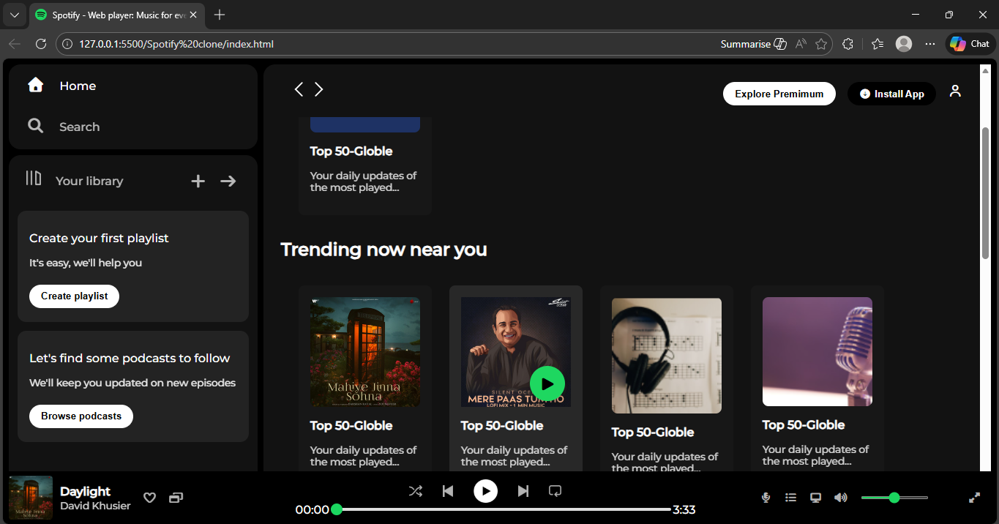

# 🎵 Spotify Clone - Web Player


A fully responsive **Spotify Web Player Clone** built using **HTML** and **CSS**. This project replicates the UI of the popular music streaming platform, including the sidebar, main content area, and the music player controller.

 

## 🚀 Features
* Responsive Design: Works on desktops and adapts to smaller screens.
* Hover Effects: Smooth animations on cards, play buttons, and navigation items.
* Custom UI Components:
    * Sticky Navigation Bar.
    * Custom Styled Range Sliders (Progress & Volume).
    * Interactive Play Buttons that appear on hover.
* Font Awesome Integration: Uses high-quality icons for a professional look.

## 🛠️ Tech Stack
* **HTML5:** Structure of the web player.
* **CSS3:** Styling, Flexbox, Positioning, and Animations.
* **Google Fonts:** Montserrat font for the authentic Spotify feel.
* **Font Awesome:** For icons like play, pause, library, etc.

## 📸 Demo
You can view the live demo here: https://rohitt-mahato.github.io/Spotify-Clone/

## 📂 Project Structure
```text
├── assets/          # Contains images, icons, and logos
├── index.html       # Main HTML file
├── style.css        # Custom CSS styles
└── README.md        # Project documentation
